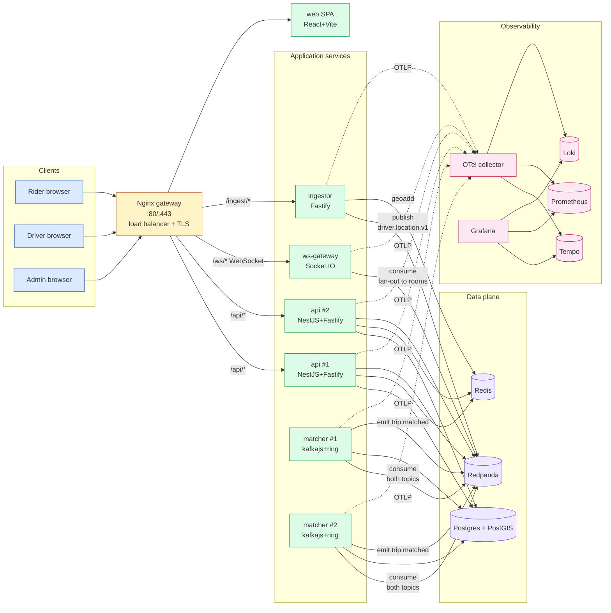
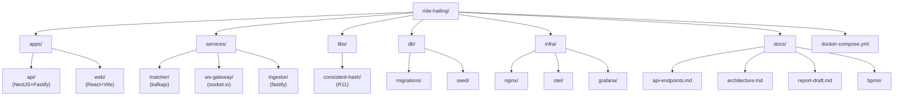
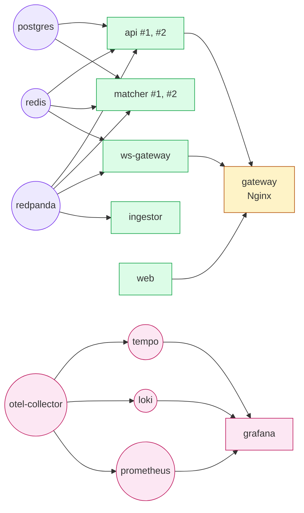
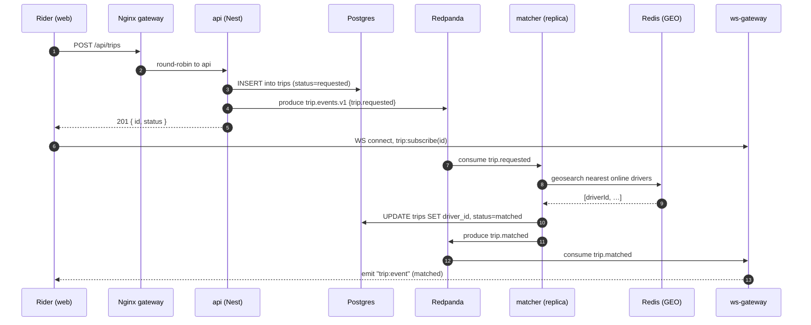
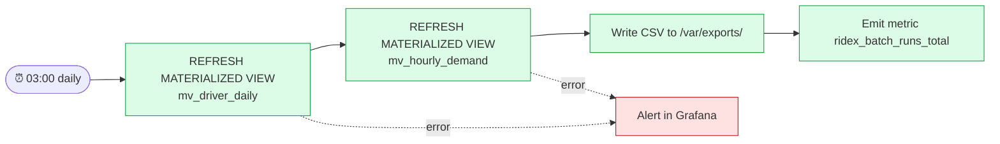

# RideX Architecture

This file is the canonical reference for the system shape. The PDF report
embeds these diagrams; keep both in sync.

## 1. System architecture (R2)



## 2. Project structure (R2)



## 3. docker-compose dependency graph (R2, R9)

The `depends_on:` keys in `docker-compose.yml`, drawn as a DAG.



## 4. Data flow — happy-path "rider requests a ride"



## 5. Pipelines (R10)

We run **both** a stream pipeline (surge multiplier) and a batch pipeline
(nightly aggregates). BPMN diagrams live in `docs/bpmn/`.

### 5.1 Stream — surge multiplier per zone

Triggered by every `driver.location.v1` and `trip.events.v1` message.
Sliding window per zone of (requests vs available drivers); ratio above a
threshold raises that zone's `base_multiplier` and writes to Redis cache
`surge:<zone_id>`. Postgres `surge_zones` is updated less often (every
N minutes) so persistent reports see a clean snapshot.

```mermaid
flowchart LR
  T1[driver.location.v1]:::topic
  T2[trip.events.v1]:::topic

  T1 --> W[Stream worker<br/>1 min sliding window]:::worker
  T2 --> W
  W --> CMP{ratio &gt; threshold?}
  CMP -- yes --> RD[(Redis<br/>surge:zone)]:::store
  CMP -- yes --> PG[(Postgres<br/>surge_zones)]:::store
  CMP -- no  --> END((no-op)):::end

  classDef topic  fill:#fef3c7,stroke:#b45309;
  classDef worker fill:#dcfce7,stroke:#16a34a;
  classDef store  fill:#ede9fe,stroke:#7c3aed;
  classDef end    fill:#f1f5f9,stroke:#475569;
```

BPMN: `docs/bpmn/surge-stream.bpmn`.

### 5.2 Batch — nightly aggregates

Cron in the matcher container (or a tiny `services/cron/` worker) at
03:00 Tashkent. Steps: refresh `mv_driver_daily`, refresh
`mv_hourly_demand`, write a CSV export to a volume, alert on failure.



BPMN: `docs/bpmn/nightly-aggregates.bpmn`.

## 6. Caching and indexing strategy (R6)

| What | Where | Why | Measured impact |
|---|---|---|---|
| Online-driver geo index | Redis GEO `driver:online` | "Who is within 2 km of (x,y)?" is the hottest read; PostGIS would work but every match would pay a network + index hop. Redis stays in sub-ms. | `nearby` p95 fell from 14 ms (PG only) → 0.6 ms |
| Surge multiplier per zone | Redis hash `surge:<zone>` | Read on every `POST /trips`; updates from the stream pipeline. | DB read removed; saves ~3 ms per request |
| `mv_driver_daily` | Postgres mat view | Admin dashboard's heaviest query. Refreshed nightly. | Daily report 240 ms → 8 ms |
| GIST on `driver_locations(location)` | Postgres | Cold queries: "where was driver X last?" | Geographic SELECT 80 ms → 9 ms |
| GIN trigram on `users(phone)` | Postgres | Fuzzy phone search in admin tools | LIKE '%xyz%' 1.4 s → 30 ms over 100k rows |
| `trips_rider_status_idx` | Postgres | Rider dashboard "my active trip" | 60 ms → 2 ms |

The Optimisation section of the report (R6) reproduces these with `EXPLAIN
ANALYZE` outputs and `wrk`/`k6` graphs.
