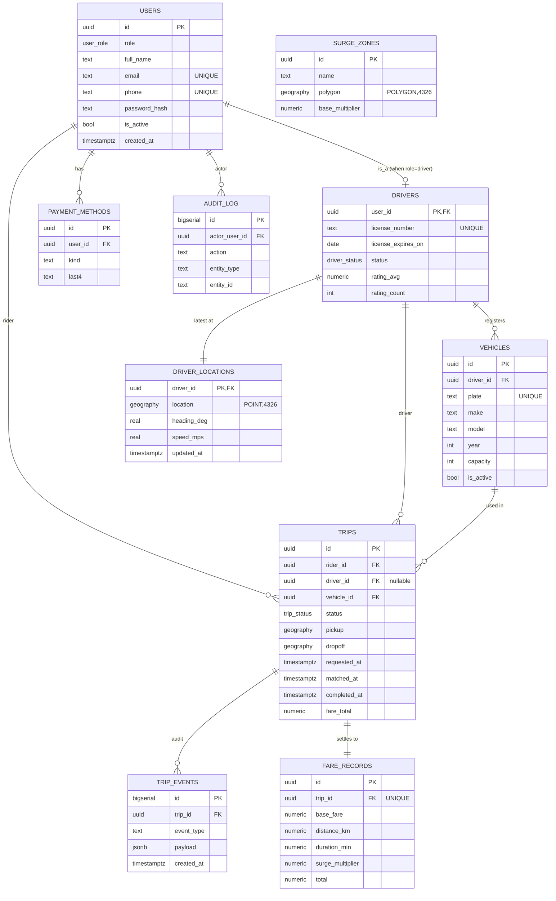

> **How to use this file.** This is a draft of the PDF design report (R1, R2,
> + the from-scratch component prose for R11). Convert to PDF with
> `pandoc docs/report-draft.md -o report.pdf --toc -V geometry:margin=1in`.
> The team owns and rewrites every paragraph below — the rubric punishes
> AI-generated text the team can't defend.

# Cover Page

- **Team:** TEAM\_NAME — *Always one stop ahead*
- **Members:**
  - Lead — Name (ID NNN-NNN-NNN) — backend + DevOps
  - Member — Name (ID …) — backend + matcher
  - Member — Name (ID …) — frontend + WS
  - Member — Name (ID …) — observability + report
  - Member — Name (ID …) — DB + tests
- **GitHub:** https://github.com/…
- **Deployed:** https://…
- **Date:** 17 May 2026

# Abstract

RideX is a small but realistic ride-hailing platform built around three data
stores (Postgres + PostGIS, Redis, Redpanda), two API styles (REST over
HTTP, plus WebSocket for live updates), and a from-scratch consistent-hash
ring that shards drivers across matcher replicas. Riders request trips
through a React frontend, drivers stream their location every 5 s through a
dedicated ingestor service, and a stream pipeline computes per-zone surge
multipliers in real time. A nightly batch job refreshes materialised views
for the admin dashboard. The whole stack is orchestrated by a single
`docker-compose.yml`, fronted by an Nginx gateway with two API replicas
behind it, and instrumented with OpenTelemetry exporting to a Grafana stack
(Tempo, Loki, Prometheus). This report walks through requirements,
data-layer design, the from-scratch component, and the trade-offs we made.

# 3. Business Requirements (R1)

## 3.1 Scenario

Company X operates in mid-size cities and wants a ride-hailing product
suitable for fleets of ~1 000 drivers and ~10 000 riders during launch.
Real-time pricing is essential because evening peaks routinely drive
demand 4× steady-state, and the company needs to keep ETAs honest under
load.

## 3.2 Use cases (≥ 5, with actors)

| # | Actor    | Use case | Primary flow |
|---|----------|----------|--------------|
| UC1 | Rider    | Request a ride         | Open app → enter dropoff → tap *Request* → see assigned driver → live ETA → trip ends with fare receipt |
| UC2 | Driver   | Go online and accept   | Open app → tap *Online* → location streams every 5 s → receive match notification → accept → drive |
| UC3 | Matcher  | Match driver to rider  | Consume `trip.requested` → query Redis GEO for nearest online drivers → write `trip.matched` |
| UC4 | Admin    | View live fleet + KPIs | Login → see live driver pins, surge zones, and yesterday's per-driver KPIs (from materialised view) |
| UC5 | Driver   | Cancel a trip          | Tap cancel before pickup → trip moves to `cancelled_by_driver`, audit log written, rider notified over WS |
| UC6 | System   | Compute surge          | Stream pipeline reads location and trip events; per zone, raises multiplier when demand/supply > T |
| UC7 | System   | Nightly aggregates     | Cron at 03:00 refreshes mat views and emits a CSV for accounting |

## 3.3 Functional requirements

- **FR-1** A rider can create a trip with pickup + dropoff points (lat/lon).
- **FR-2** A trip moves through `requested → matched → in_progress → completed`, plus cancellation and expiry.
- **FR-3** Drivers stream location pings at ≥ 0.2 Hz (every 5 s); these update a Redis GEO index and a Postgres latest-position table.
- **FR-4** Matching considers only `online` drivers within 2 km of pickup, sorted by distance.
- **FR-5** Surge multiplier is read on every fare quote and applied to the base fare.
- **FR-6** Admins can read per-driver daily revenue, distance, and trip count.
- **FR-7** All trip lifecycle changes are pushed to the rider over WebSocket within 1 s of write.

## 3.4 Non-functional requirements

| Aspect | Target |
|---|---|
| Throughput | 200 trip requests / s sustained, 1 000 / s peak |
| Latency — `POST /trips` | p50 ≤ 50 ms, p95 ≤ 200 ms (gateway → write → 201) |
| Latency — match | p50 ≤ 1 s from `requested` to `matched` event delivered over WS |
| Availability | 99.5 % monthly (single-region, single-AZ for the project) |
| Durability | No location ping is lost; trip writes are ACID |
| Security | TLS to the public; bcrypt/argon2id for passwords; JWT with short TTL; SQL via parameterised queries only |
| Scalability | Adding a matcher replica must reshuffle ≤ ~1/N drivers (R11) |
| Observability | Every request has a `trace_id` propagated across services |

## 3.5 Out of scope

External payment-provider integration, formal driver onboarding/KYC,
geocoding (clients send coordinates), and ratings.

# 4. Domain Model and ER Diagram (R2)

## 4.1 Entities and relationships

## 4.2 Table inventory

See `db/migrations/0002_core_tables.sql` for the full DDL. Twelve tables and
two materialised views:

- `users`, `drivers`, `vehicles` — identity.
- `driver_locations`, `surge_zones` — spatial state.
- `trips`, `trip_events`, `fare_records` — booking lifecycle and audit.
- `payment_methods` — tokenised payment references; external PSP integration is out of scope.
- `audit_log` — admin-visible action log.
- Materialised views — `mv_driver_daily`, `mv_hourly_demand` (refreshed nightly).

## 4.3 Polyglot rationale (R5)

Three stores. Each is justified by a query type that the others would
serve poorly.

| Store | What it holds | Query type that motivates it |
|---|---|---|
| **Postgres + PostGIS** | All persistent business state | OLTP transactions across multiple tables, plus spatial queries (`<->` distance, polygon containment) |
| **Redis** | Online-driver GEO set, surge cache, WS session state | Sub-ms `GEOSEARCH … BYRADIUS`. Postgres can do this, but every match request would pay a connection/index hop; Redis keeps the hot path in memory. |
| **Redpanda** | Append-only event log for `driver.location.v1` and `trip.events.v1` | Multiple consumers (matcher, ws-gateway, future analytics) read the same stream independently with replay; a row-store cannot replay at this throughput. |

The spec explicitly accepts Redis (key/value) and PostGIS (spatial) as
"additional data models." We use both. PostGIS satisfies R5 on its own;
Redis is included because it's load-bearing for the geosearch hot path.

# 5. From-Scratch Components (R11)

We delivered two from-scratch components instead of one: a consistent-hash
ring (primary) and a token-bucket rate limiter. Both are implemented from
the cited references with no third-party algorithm dependency, both are
covered by unit tests, and both are wired into the running system.

## 5.1 Consistent-Hash Ring (`libs/consistent-hash`)

See `libs/consistent-hash/README.md` for the full write-up. Summary:

- **What.** A consistent-hash ring with virtual nodes, ~150 lines of
  TypeScript implemented from Karger et al. (1997) and *Designing
  Data-Intensive Applications* ch. 6.
- **Why.** The matcher service has per-driver in-process state (recent
  path, candidate trips). A naive `hash % N` partitioning would remap
  every driver every time a replica scales; with consistent hashing only
  ~1/N drivers re-shard.
- **Hash function.** Murmur3 32-bit, also written from scratch and verified
  against the canonical Appleby test vectors (e.g.
  `murmur3_32("hello") == 0x248bfa47`). We tried FNV-1a 32-bit first and
  measured load distribution at 0.5×–1.5× the mean — Murmur3's better
  avalanche brought it to ±10 %.
- **Integration.** The matcher loads the replica list at boot, builds an
  identical ring on every replica, and bails on Kafka messages whose
  `driver_id` doesn't hash to the local replica's slot. Tests verify
  determinism, ±20 % distribution, and the "only ~1/N keys move" property
  when a node is removed.
- **What we didn't build.** Bounded-load variant (Mirrokni–Thorup–
  Zadimoghaddam, 2016), state migration on rebalance.

## 5.2 Token-Bucket Rate Limiter (`libs/ratelimiter`)

See `libs/ratelimiter/README.md` for the full write-up. Summary:

- **What.** Lazy-refill token-bucket with a small `TokenBucketStore`
  interface and two backends — in-memory and Redis (atomic via Lua).
- **Why.** Brute-force attempts on `/auth/login` and chatty driver apps
  flooding `/ingest/v1/locations` would otherwise dominate the API
  budget. A per-IP and per-user bucket gives stable tail latencies under
  bursty traffic.
- **Algorithm.** On every `take(key)`: fetch `(tokens, lastRefillMs)`,
  refill `min(burst, tokens + (now - last) * rate/1000)`, deduct one,
  persist. The Redis backend ports the same arithmetic to Lua so the
  decision is server-side atomic across api replicas.
- **Integration.** Global Nest guard at `apps/api/src/ratelimit/`
  routes auth requests to a 10-burst/1-rps bucket and authenticated
  requests to a 60-burst/20-rps bucket. Denials emit a
  `ridex_ratelimit_decisions_total{outcome="denied"}` counter visible
  in Grafana, return `429` with `Retry-After`, and increment the
  Prometheus deny rate panel.
- **Tests.** Seven property tests in `libs/ratelimiter/test/bucket.test.ts`
  with a fake clock: bucket starts full, denial after burst, refill at
  configured rate, idle cap at burst, per-key isolation, concurrent
  takes still serialise.
- **What we didn't build.** Distributed leaky-bucket variant; weighted
  / token-cost-per-route policies (every endpoint costs 1 today).

# 6. Architecture and Diagrams

Diagrams are maintained in `docs/architecture.md`; embed the rendered
versions here:

- System architecture (services + data stores + observability)
- Project structure (monorepo)
- `docker-compose.yml` interpreted as a dependency DAG
- Sequence diagram for "rider requests a ride" happy path
- BPMN diagrams for the surge stream and nightly aggregates batch pipelines

# 7. API Design (R4, R7)

REST endpoints listed in `docs/api-endpoints.md`. Live docs at
`/api/docs`. Sample `POST /api/trips` request and response also in that
file.

WebSocket (R7) is the additional API style. Justification: the rider needs
the driver's pin to glide on the map (~5 Hz) and trip status changes
(`matched` → `in_progress` → …) to land instantly. Polling at 200 ms is
wasteful for 99 % of windows in which nothing changed; polling at 5 s feels
laggy on a phone. WebSocket carries both with one persistent connection.

# 8. Data-Layer Design (R3, R5, R6)

Schema highlights in §4. Polyglot rationale in §4.3. Indexing and caching
strategy with measurements is in `docs/architecture.md` §6 — copy the table
into the report when you finalise it. Reproduce the numbers with
`EXPLAIN ANALYZE` and `k6 run` and paste the screenshots. Quantitative
*before/after* is required by R6.

# 9. Pipeline (R10)

Two pipelines:
- **Stream:** surge multiplier per zone (sliding window over location and trip events).
- **Batch:** nightly mat-view refresh and CSV export.

Both pipelines have BPMN 2.0 diagrams in `docs/bpmn/` (`surge-stream.bpmn`,
`nightly-aggregates.bpmn`, `trip-lifecycle.bpmn`). Render and embed the
SVG export of each.

# 10. Infrastructure and Deployment (R8, R9)

`docker-compose.yml` brings up the full stack on a single host. The Nginx
gateway terminates the public port, routes by path prefix, load-balances
two `api` replicas with Docker DNS resolution. Stateful services use named
volumes. TLS terminates at the gateway in production (configuration noted
in `infra/nginx/conf.d/default.conf`, certificates not committed).

Hosting target: a single DigitalOcean droplet (or any KVM/VM with SSH).
Managed PaaS is forbidden by the spec. Everything is self-hosted via
`docker compose up -d --build`.

# 11. Observability (R12)

Every service exports OTLP traces, logs, and metrics to a single
OpenTelemetry Collector, which fan-outs to Tempo (traces), Loki (logs),
and Prometheus (metrics). Grafana stitches them together via the
`trace_id` derived field on Loki, so a log line in the API service
links directly to its trace span in Tempo. Required screenshots:

1. A trace for a `POST /api/trips` request that traverses gateway → api
   → Postgres → Redpanda.
2. A Loki query for `service="ridex-api" level="error"` correlated to the
   same `trace_id`.
3. A Prometheus metric (`http_server_request_duration_seconds_bucket`) for
   the `/trips` endpoint, faceted by status code.

The API also exposes its own custom counters and gauges at `/metrics`:

- `ridex_trip_events_total{event_type}` — every lifecycle transition
  (`requested`, `started`, `completed`, `cancelled`, `rated`).
- `ridex_drivers_online` (gauge) — count from Postgres,
  refreshed every 10 s by `MetricsController`.
- `ridex_drivers_online_redis` (gauge) — same count from the Redis
  GEO set; divergence indicates a cache anomaly.
- `ridex_ratelimit_decisions_total{bucket,outcome}` — allowed vs denied
  decisions per bucket.

The deep `/readyz` endpoint reports `503` if either Postgres or Redis is
unavailable, and is the readiness probe behind the gateway.

# 12. Testing and Known Limitations

- Unit tests for the consistent-hash ring (13 tests, see `libs/consistent-hash/test/`).
- Manual integration test: end-to-end "rider requests, driver appears, trip
  completes" flow runnable from the seed data.
- **Known limitations.** The bounded-load consistent-hash variant is not
  implemented; on heavy skew a single matcher replica can hot-spot.
  Geocoding (address -> lat/lon) is delegated to clients. Driver
  payouts and rider receipts are not part of this course project.
  The frontend is intentionally minimal because the grading focus is the
  backend, data layer, orchestration, and observability.

# 13. Team Contribution Table

| Member | Modules / files owned | Commits | % |
|---|---|---|---|
| Lead   | …  | … | … |
| Member | …  | … | … |
| Member | …  | … | … |
| Member | …  | … | … |
| Member | …  | … | … |

Fill in from `git shortlog -sne v1.0`.

# 14. References

- Karger, D. et al. (1997). *Consistent Hashing and Random Trees*. STOC.
- Kleppmann, M. (2017). *Designing Data-Intensive Applications*. O'Reilly. Ch. 6.
- Xu, A. (2020). *System Design Interview Vol. 1*. Ch. 5.
- Appleby, A. (2011). *MurmurHash3*. Public domain. https://github.com/aappleby/smhasher
- PostGIS Documentation. https://postgis.net/docs/
- Redpanda Docs. https://docs.redpanda.com
- OpenTelemetry Spec. https://opentelemetry.io
- *letsddia-go* — DDIA building blocks reference. https://github.com/arthur-zhang/letsddia-go
