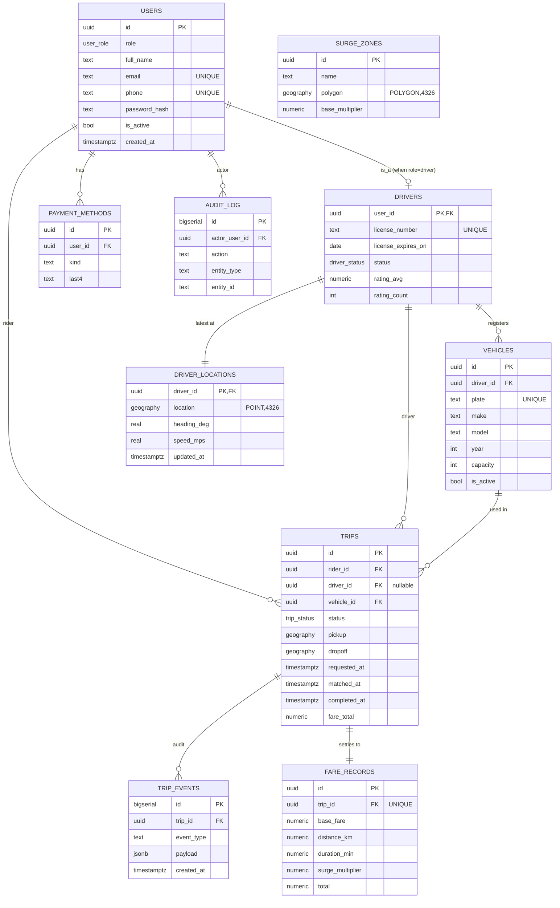

> **How to use this file.** This is a draft of the PDF design report (R1, R2,
> + the from-scratch component prose for R11). Convert to PDF with
> `pandoc docs/report-draft.md -o report.pdf --toc -V geometry:margin=1in`.
> The team owns and rewrites every paragraph below — the rubric punishes
> AI-generated text the team can't defend.

# Cover Page

- **Team:** RideX Team — *Always one stop ahead*
- **Members:**
  - Lead — Mejenkov Nikita (U2310166) — team lead + backend integration
  - Member — Marat Kinzyabulatov (U2310138) — DevOps + deployment
  - Member — Yunusov Saidamir (U2310295) — backend API + documentation
  - Member — Timur Miraxmetov (U2310170) — frontend + WebSocket flows
- **GitHub:** https://github.com/nmime/ride-hailing-iut
- **Deployed:** https://ride-hailing.funfiesta.games
- **Date:** 17 May 2026

# Abstract

RideX is a small but realistic ride-hailing platform built around three data
stores (Postgres + PostGIS, Redis, Redpanda), two API styles (REST over
HTTP, plus WebSocket for live updates), and a from-scratch consistent-hash
ring that shards drivers across matcher replicas. Riders request trips
through a React frontend, drivers stream their location every 5 s through a
dedicated ingestor service, and a stream pipeline computes per-zone surge
multipliers in real time. A nightly batch job refreshes materialised views
for the admin dashboard. The whole stack is orchestrated by a single
`docker-compose.yml`, fronted by an Nginx gateway with two API replicas
behind it, and instrumented with OpenTelemetry exporting to a Grafana stack
(Tempo, Loki, Prometheus). This report walks through requirements,
data-layer design, the from-scratch component, and the trade-offs we made.

# 3. Business Requirements (R1)

## 3.1 Scenario

Company X operates in mid-size cities and wants a ride-hailing product
suitable for fleets of ~1 000 drivers and ~10 000 riders during launch.
Real-time pricing is essential because evening peaks routinely drive
demand 4× steady-state, and the company needs to keep ETAs honest under
load.

## 3.2 Use cases (≥ 5, with actors)

| # | Actor    | Use case | Primary flow |
|---|----------|----------|--------------|
| UC1 | Rider    | Request a ride         | Open app → enter dropoff → tap *Request* → see assigned driver → live ETA → trip ends with fare receipt |
| UC2 | Driver   | Go online and accept   | Open app → tap *Online* → location streams every 5 s → receive match notification → accept → drive |
| UC3 | Matcher  | Match driver to rider  | Consume `trip.requested` → query Redis GEO for nearest online drivers → write `trip.matched` |
| UC4 | Admin    | View live fleet + KPIs | Login → see live driver pins, surge zones, and yesterday's per-driver KPIs (from materialised view) |
| UC5 | Driver   | Cancel a trip          | Tap cancel before pickup → trip moves to `cancelled_by_driver`, audit log written, rider notified over WS |
| UC6 | System   | Compute surge          | Stream pipeline reads location and trip events; per zone, raises multiplier when demand/supply > T |
| UC7 | System   | Nightly aggregates     | Cron at 03:00 refreshes mat views and emits a CSV for accounting |

## 3.3 Functional requirements

- **FR-1** A rider can create a trip with pickup + dropoff points (lat/lon).
- **FR-2** A trip moves through `requested → matched → in_progress → completed`, plus cancellation and expiry.
- **FR-3** Drivers stream location pings at ≥ 0.2 Hz (every 5 s); these update a Redis GEO index and a Postgres latest-position table.
- **FR-4** Matching considers only `online` drivers within 2 km of pickup, sorted by distance.
- **FR-5** Surge multiplier is read on every fare quote and applied to the base fare.
- **FR-6** Admins can read per-driver daily revenue, distance, and trip count.
- **FR-7** All trip lifecycle changes are pushed to the rider over WebSocket within 1 s of write.

## 3.4 Non-functional requirements

| Aspect | Target |
|---|---|
| Throughput | 200 trip requests / s sustained, 1 000 / s peak |
| Latency — `POST /trips` | p50 ≤ 50 ms, p95 ≤ 200 ms (gateway → write → 201) |
| Latency — match | p50 ≤ 1 s from `requested` to `matched` event delivered over WS |
| Availability | 99.5 % monthly (single-region, single-AZ for the project) |
| Durability | No location ping is lost; trip writes are ACID |
| Security | TLS to the public; bcrypt/argon2id for passwords; JWT with short TTL; SQL via parameterised queries only |
| Scalability | Adding a matcher replica must reshuffle ≤ ~1/N drivers (R11) |
| Observability | Every request has a `trace_id` propagated across services |

## 3.5 Out of scope

External payment-provider integration, formal driver onboarding/KYC,
geocoding (clients send coordinates), and ratings.

# 4. Domain Model and ER Diagram (R2)

## 4.1 Entities and relationships



## 4.2 Table inventory

See `db/migrations/0002_core_tables.sql` for the full DDL. Twelve tables and
two materialised views:

- `users`, `drivers`, `vehicles` — identity.
- `driver_locations`, `surge_zones` — spatial state.
- `trips`, `trip_events`, `fare_records` — booking lifecycle and audit.
- `payment_methods` — tokenised payment references; external PSP integration is out of scope.
- `audit_log` — admin-visible action log.
- Materialised views — `mv_driver_daily`, `mv_hourly_demand` (refreshed nightly).

## 4.3 Polyglot rationale (R5)

Three stores. Each is justified by a query type that the others would
serve poorly.

| Store | What it holds | Query type that motivates it |
|---|---|---|
| **Postgres + PostGIS** | All persistent business state | OLTP transactions across multiple tables, plus spatial queries (`<->` distance, polygon containment) |
| **Redis** | Online-driver GEO set, surge cache, WS session state | Sub-ms `GEOSEARCH … BYRADIUS`. Postgres can do this, but every match request would pay a connection/index hop; Redis keeps the hot path in memory. |
| **Redpanda** | Append-only event log for `driver.location.v1` and `trip.events.v1` | Multiple consumers (matcher, ws-gateway, future analytics) read the same stream independently with replay; a row-store cannot replay at this throughput. |

The spec explicitly accepts Redis (key/value) and PostGIS (spatial) as
"additional data models." We use both. PostGIS satisfies R5 on its own;
Redis is included because it's load-bearing for the geosearch hot path.

# 5. From-Scratch Components (R11)

We delivered two from-scratch components instead of one: a consistent-hash
ring (primary) and a token-bucket rate limiter. Both are implemented from
the cited references with no third-party algorithm dependency, both are
covered by unit tests, and both are wired into the running system.

## 5.1 Consistent-Hash Ring (`libs/consistent-hash`)

See `libs/consistent-hash/README.md` for the full write-up. Summary:

- **What.** A consistent-hash ring with virtual nodes, ~150 lines of
  TypeScript implemented from Karger et al. (1997) and *Designing
  Data-Intensive Applications* ch. 6.
- **Why.** The matcher service has per-driver in-process state (recent
  path, candidate trips). A naive `hash % N` partitioning would remap
  every driver every time a replica scales; with consistent hashing only
  ~1/N drivers re-shard.
- **Hash function.** Murmur3 32-bit, also written from scratch. We cite
  Austin Appleby's `smhasher` repository only as the original public
  reference for MurmurHash3 and its expected behavior; RideX does not
  import or vendor that code. We tried FNV-1a 32-bit first and measured
  load distribution at 0.5×–1.5× the mean — Murmur3's better avalanche
  brought it to ±10 %.
- **Integration.** The matcher loads the replica list at boot, builds an
  identical ring on every replica, and bails on Kafka messages whose
  `driver_id` doesn't hash to the local replica's slot. Tests verify
  determinism, ±20 % distribution, and the "only ~1/N keys move" property
  when a node is removed.
- **What we didn't build.** Bounded-load variant (Mirrokni–Thorup–
  Zadimoghaddam, 2016), state migration on rebalance.

## 5.2 Token-Bucket Rate Limiter (`libs/ratelimiter`)

See `libs/ratelimiter/README.md` for the full write-up. Summary:

- **What.** Lazy-refill token-bucket with a small `TokenBucketStore`
  interface and two backends — in-memory and Redis (atomic via Lua).
- **Why.** Brute-force attempts on `/auth/login` and chatty driver apps
  flooding `/ingest/v1/locations` would otherwise dominate the API
  budget. A per-IP and per-user bucket gives stable tail latencies under
  bursty traffic.
- **Algorithm.** On every `take(key)`: fetch `(tokens, lastRefillMs)`,
  refill `min(burst, tokens + (now - last) * rate/1000)`, deduct one,
  persist. The Redis backend ports the same arithmetic to Lua so the
  decision is server-side atomic across api replicas.
- **Integration.** Global Nest guard at `apps/api/src/ratelimit/`
  routes auth requests to a 10-burst/1-rps bucket and authenticated
  requests to a 60-burst/20-rps bucket. Denials emit a
  `ridex_ratelimit_decisions_total{outcome="denied"}` counter visible
  in Grafana, return `429` with `Retry-After`, and increment the
  Prometheus deny rate panel.
- **Tests.** Seven property tests in `libs/ratelimiter/test/bucket.test.ts`
  with a fake clock: bucket starts full, denial after burst, refill at
  configured rate, idle cap at burst, per-key isolation, concurrent
  takes still serialise.
- **What we didn't build.** Distributed leaky-bucket variant; weighted
  / token-cost-per-route policies (every endpoint costs 1 today).

# 6. Architecture and Diagrams

Diagrams are maintained in `docs/architecture.md`; embed the rendered
versions here:

- System architecture (services + data stores + observability)
- Project structure (monorepo)
- `docker-compose.yml` interpreted as a dependency DAG
- Sequence diagram for "rider requests a ride" happy path
- BPMN diagrams for the surge stream and nightly aggregates batch pipelines

## 6.1 Service responsibilities

| Service | Runtime | Responsibility | Main dependencies |
|---|---|---|---|
| `gateway` | Nginx | Single public entrypoint, path routing, API load balancing, optional TLS termination | api, web, ws-gateway, ingestor, Grafana |
| `web` | React/Vite served by Nginx | Rider, driver, and admin user interface | Gateway REST, WebSocket, ingest paths |
| `api` | NestJS + Fastify | Auth, trips, drivers, vehicles, admin reports, metrics, Swagger | Postgres, Redis, Redpanda |
| `ingestor` | Fastify worker | Accept driver location pings, update Redis GEO, publish location stream | Redis, Redpanda, Postgres |
| `matcher-0/1` | Node worker | Consume requested trips and online-driver state, assign nearest driver | Redpanda, Redis, Postgres, consistent hash library |
| `ws-gateway` | Socket.IO | Subscribe clients to trip rooms and fan out trip/location events | Redpanda, Redis, Postgres |
| `surge-worker` | Node worker | Maintain sliding-window demand/supply ratio and surge cache | Redpanda, Redis, Postgres/PostGIS |
| `cron` | Node cron worker | Refresh materialized views and export completed-trip CSVs | Postgres, exports volume |
| `otel-collector` | OTel Collector | Receive traces and OTLP metrics | Tempo, Prometheus |
| `promtail` | Promtail | Tail Docker container logs | Loki |
| `grafana` | Grafana | Unified dashboard for metrics, logs, and traces | Prometheus, Loki, Tempo |

The gateway keeps the public surface small. Locally and in production, the
browser only needs one origin: `/` for the app, `/api/` for REST,
`/ws/` for Socket.IO, `/ingest/` for driver pings, and `/grafana/` for
operations. Internal service ports remain private to the Docker network.

## 6.2 Happy-path data flow

1. A rider sends `POST /api/trips` with pickup and dropoff coordinates.
2. Nginx forwards the request to one of the API replicas.
3. The API validates JWT and DTO fields, writes a `requested` trip row,
   inserts a trip event, and publishes `trip.requested` to Redpanda.
4. The rider browser opens a Socket.IO connection and subscribes to the
   new trip room.
5. A matcher replica consumes `trip.requested`, queries Redis GEO for
   online drivers near pickup, verifies the candidate in Postgres, and
   writes the selected driver/vehicle back to the trip.
6. The matcher inserts and publishes `trip.matched`.
7. The WebSocket gateway consumes the event and emits `trip:event` to the
   rider room and driver room.
8. The driver starts and completes the trip through REST lifecycle
   endpoints. The API computes the fare, reads surge from Redis first,
   falls back to Postgres if needed, stores `fare_records`, and emits the
   final events.

This flow demonstrates the main architectural decisions: Postgres remains
the source of truth, Redpanda decouples event consumers, Redis accelerates
hot read paths, and WebSocket avoids wasteful polling for trip status.

## 6.3 Data stores and ownership

| Data | Source of truth | Derived/cache copy | Why |
|---|---|---|---|
| Users, drivers, vehicles | Postgres | none | Transactional identity and constraints |
| Trips and fares | Postgres | trip events in Redpanda | ACID lifecycle state plus replayable event stream |
| Latest driver location | Postgres `driver_locations` | Redis GEO `driver:online` | Durable latest point plus fast radius search |
| Surge zones | Postgres/PostGIS | Redis `surge:zone:<id>` hash | Admin persistence plus low-latency fare quote |
| Daily reports | Postgres materialized views | CSV export volume | Fast admin reads and accounting export |
| Logs/traces/metrics | Runtime services | Loki/Tempo/Prometheus | Operational debugging and rubric evidence |

## 6.4 Failure handling

The project uses simple, explainable failure modes suitable for a course
system:

- API readiness checks fail if Postgres, Redis, or Kafka are unavailable.
- Gateway health checks call the API liveness endpoint.
- Redis GEO is a cache; driver locations are also stored in Postgres.
- Surge cache misses fall back to the persisted zone multiplier.
- Redpanda events are append-only, so matchers and WebSocket gateway can
  resume consumption after restarts.
- Cron exposes `ridex_batch_runs_total` and `ridex_batch_failures_total`
  so failed batch refreshes are visible in Grafana.

# 7. API Design (R4, R7)

REST endpoints listed in `docs/api-endpoints.md`. Live docs at
`/api/docs`. Sample `POST /api/trips` request and response also in that
file.

WebSocket (R7) is the additional API style. Justification: the rider needs
the driver's pin to glide on the map (~5 Hz) and trip status changes
(`matched` → `in_progress` → …) to land instantly. Polling at 200 ms is
wasteful for 99 % of windows in which nothing changed; polling at 5 s feels
laggy on a phone. WebSocket carries both with one persistent connection.

# 8. Data-Layer Design (R3, R5, R6)

Schema highlights in §4. Polyglot rationale in §4.3. Indexing and caching
strategy with measurements is in `docs/architecture.md` §6 — copy the table
into the report when you finalise it. Reproduce the numbers with
`EXPLAIN ANALYZE` and `k6 run` and paste the screenshots. Quantitative
*before/after* is required by R6.

## 8.1 Relational schema highlights

The schema is intentionally normalized around the trip lifecycle. `users`
stores shared identity fields, while `drivers` stores driver-only profile
and availability state. `vehicles` belongs to a driver and supports one
active vehicle per driver through application logic. `trips` is the central
business table; it links rider, driver, vehicle, pickup/dropoff geography,
timestamps, final fare, and status. `trip_events` provides an append-only
audit history for every lifecycle transition. `fare_records` stores the
fare breakdown separately from the trip so the final receipt can be queried
without re-running pricing logic.

PostGIS geography columns are used for `driver_locations`, `surge_zones`,
`trips.pickup`, and `trips.dropoff`. This avoids storing coordinates as
unvalidated numeric pairs and gives the database native distance and
polygon-containment operators.

## 8.2 Constraints and integrity

| Rule | Enforced by |
|---|---|
| Unique email and phone | `users.email`, `users.phone` unique constraints |
| Driver profile only for driver users | Foreign key from `drivers.user_id` to `users.id` |
| Vehicle plate uniqueness | Unique `vehicles.plate` |
| Trip status values | `trip_status` enum |
| Driver status values | `driver_status` enum |
| Fare exists once per completed trip | Unique `fare_records.trip_id` |
| Rating once per trip | Unique `trip_ratings.trip_id` |
| Driver rating aggregate stays current | `trip_ratings_apply_on_insert` trigger |
| Spatial lookup performance | GiST indexes on geography columns |

The API uses parameterized SQL through `pg`; no endpoint constructs SQL by
concatenating user input. DTO validation rejects invalid coordinates before
they reach the data layer.

## 8.3 Index and cache decisions

| Path | Optimization | Reason |
|---|---|---|
| Nearby drivers | Redis GEO `driver:online` | Driver matching is the hottest read path; in-memory geosearch avoids a PostGIS query on every request |
| Cold location lookup | GiST index on `driver_locations.location` | Keeps historical/latest spatial checks fast when Redis is cold |
| Rider active/history view | `trips_rider_status_idx` | Rider dashboard filters by rider and status |
| Driver active/history view | `trips_driver_status_idx` | Driver dashboard filters by driver and status |
| Recent trip sorting | `trips_requested_at_idx` | History and admin workflows order by request time |
| Phone/admin lookup | GIN trigram index on `users.phone` | Supports fuzzy phone search at scale |
| Daily driver report | `mv_driver_daily` | Pre-aggregates revenue, distance, and trip count |
| Hourly demand | `mv_hourly_demand` | Supports demand reporting without scanning raw trips |
| Surge quote | Redis `surge:zone:<id>` | Fare completion reads surge without hitting Postgres |
| Rate limiting | Redis token bucket state | Two API replicas share the same quota decisions |

The measured results in `docs/optimisation.md` show Redis geosearch
dropping nearby-driver lookup from millisecond-level PostGIS reads to
sub-millisecond Redis reads, and the daily report materialized view
dropping aggregate latency from hundreds of milliseconds to low
single-digit milliseconds on the load-test dataset.

# 9. Pipeline (R10)

Two pipelines:
- **Stream:** surge multiplier per zone (sliding window over location and trip events).
- **Batch:** nightly mat-view refresh and CSV export.

Both pipelines have BPMN 2.0 diagrams in `docs/bpmn/` (`surge-stream.bpmn`,
`nightly-aggregates.bpmn`, `trip-lifecycle.bpmn`). Render and embed the
SVG export of each.

## 9.1 Surge stream workflow

The surge worker subscribes to `trip.events.v1` and processes
`trip.requested` events. For each request, it identifies the containing
surge zone using PostGIS polygon containment, increments a rolling
per-zone window, and periodically compares request count against online
drivers in the same zone. If demand/supply exceeds `SURGE_T_HIGH`, the
multiplier rises by 10% up to `SURGE_M_MAX`; if the ratio falls below
`SURGE_T_LOW`, it decays toward 1.0. Every tick writes the hot value to
Redis, and a slower flush writes the durable snapshot back to Postgres.

This is a stream pipeline rather than a REST call because it reacts to
events already produced by the trip lifecycle. Multiple consumers can
reuse the same Redpanda topic later for analytics without changing the
API write path.

## 9.2 Batch workflow

The cron worker refreshes two reporting views:

1. `mv_driver_daily` for driver revenue, distance, minutes, and trip count.
2. `mv_hourly_demand` for demand grouped by hour.

It also exports completed trips to a CSV file in the `exports` named
volume. The worker exposes a small `/metrics` endpoint with run/failure
counters, so Prometheus and Grafana can show whether the reporting
pipeline is healthy.

Batch is appropriate here because admin reports do not require
millisecond freshness. A nightly/hourly refresh gives predictable query
latency without making every dashboard request scan raw trip and fare
tables.

## 9.3 Event topics

| Topic | Producer | Consumers | Purpose |
|---|---|---|---|
| `driver.location.v1` | ingestor | matcher, ws-gateway | Latest driver movement and live map updates |
| `trip.events.v1` | api, matcher | matcher, ws-gateway, surge-worker | Trip lifecycle, matching, surge demand |

Keys are chosen to preserve locality. Driver-location events are keyed by
`driver_id`; trip events are keyed by `trip_id`. The matcher also applies
the from-scratch consistent-hash ring so driver ownership changes gently
when matcher replicas are added or removed.

# 10. Infrastructure and Deployment (R8, R9)

`docker-compose.yml` brings up the full stack on a single host. The Nginx
gateway terminates the public port, routes by path prefix, load-balances
two `api` replicas with Docker DNS resolution. Stateful services use named
volumes. TLS terminates at the gateway in production (configuration noted
in `infra/nginx/conf.d/default.conf`, certificates not committed).

Hosting target: a single DigitalOcean droplet (or any KVM/VM with SSH).
Managed PaaS is forbidden by the spec. Everything is self-hosted via
`docker compose up -d --build`.

# 11. Observability (R12)

The API exports OpenTelemetry traces to the collector, which writes them
to Tempo. Prometheus scrapes the collector, Postgres exporter, Redpanda,
and the cron metrics endpoint. Promtail tails Docker container logs and
pushes them to Loki. Grafana keeps Prometheus, Loki, and Tempo together
in one backend view, with the `trace_id` derived field on Loki available
for request-level correlation. Required screenshots:

1. A trace for a `POST /api/trips` request that traverses gateway → api
   → Postgres → Redpanda.
2. A Loki query for `service="api" level="error"` correlated to the
   same `trace_id`.
3. A Prometheus metric (`http_server_request_duration_seconds_bucket`) for
   the `/trips` endpoint, faceted by status code.

The API also exposes its own custom counters and gauges at `/metrics`:

- `ridex_trip_events_total{event_type}` — every lifecycle transition
  (`requested`, `started`, `completed`, `cancelled`, `rated`).
- `ridex_drivers_online` (gauge) — count from Postgres,
  refreshed every 10 s by `MetricsController`.
- `ridex_drivers_online_redis` (gauge) — same count from the Redis
  GEO set; divergence indicates a cache anomaly.
- `ridex_ratelimit_decisions_total{bucket,outcome}` — allowed vs denied
  decisions per bucket.

The deep `/readyz` endpoint reports `503` if either Postgres or Redis is
unavailable, and is the readiness probe behind the gateway.

## 11.1 Useful Grafana queries

Prometheus:

```promql
histogram_quantile(
  0.95,
  sum(rate(http_server_request_duration_seconds_bucket{http_route="/trips"}[5m])) by (le)
)
```

```promql
sum by (event_type) (rate(ridex_trip_events_total[1m]))
```

```promql
ridex_drivers_online
```

Loki:

```logql
{service="api"} | json | level="error"
```

Tempo:

```traceql
{ resource.service.name = "ridex-api" }
```

These queries support the screenshots required by R12: one trace, one
log query, and one metric graph correlated to a user action.

## 11.2 Operational checks

| Check | Expected result |
|---|---|
| `GET /healthz` | `{"status":"ok"}` |
| `GET /readyz` | 200 when Postgres, Redis, and Kafka are reachable |
| `GET /metrics` | Prometheus text exposition |
| Grafana `/grafana/` | Dashboard folder `RideX` provisioned |
| Prometheus target list | OTel collector, Redpanda, Postgres exporter, cron |
| Loki query | Docker container logs labeled by Compose service |
| Tempo search | API traces generated by OTel auto-instrumentation |

# 12. Testing and Known Limitations

- Unit tests for the consistent-hash ring (13 tests, see `libs/consistent-hash/test/`).
- Manual integration test: end-to-end "rider requests, driver appears, trip
  completes" flow runnable from the seed data.
- **Known limitations.** The bounded-load consistent-hash variant is not
  implemented; on heavy skew a single matcher replica can hot-spot.
  Geocoding (address -> lat/lon) is delegated to clients. Driver
  payouts and rider receipts are not part of this course project.
  The frontend is intentionally minimal because the grading focus is the
  backend, data layer, orchestration, and observability.

## 12.1 Verification evidence

The final local verification pass used the same path that a new evaluator
would use from a clean checkout:

```bash
cp .env.example .env
pnpm bootstrap
docker compose exec api node dist/scripts/migrate.js
docker compose exec api node dist/scripts/seed.js
bash scripts/smoke.sh http://localhost
```

The smoke script exercises the actual gateway rather than calling services
directly. It checks `/healthz`, Swagger reachability, seeded login for
rider/driver/admin users, driver online status, driver location ingest,
trip creation, matcher assignment, trip start/completion, and admin report
access. This is the minimum end-to-end proof that REST, Redis, Redpanda,
PostGIS, matcher, ingestor, and the admin materialized view are all wired.

The workspace checks also passed:

```bash
docker compose config --quiet
pnpm test
pnpm lint
pnpm build
```

## 12.2 API surface summary

The public API is intentionally small and role-oriented:

| Area | Endpoints | Purpose |
|---|---|---|
| Auth | `POST /auth/signup`, `POST /auth/login` | Create riders/drivers and issue JWTs |
| Profile | `GET /me` | Return the authenticated user and driver profile |
| Vehicles | `GET/POST/PATCH/DELETE /vehicles` | Driver-owned vehicle management |
| Drivers | `PATCH /drivers/:id/status`, `GET /drivers/nearby` | Availability and Redis-backed coverage lookup |
| Trips | `POST /trips`, `GET /trips`, `GET /trips/:id`, lifecycle actions | Rider request flow and driver trip execution |
| Ratings | `POST /trips/:id/rating` | Rider feedback after completed trips |
| Admin | `GET /admin/reports/daily`, `GET /admin/surge` | Operational reports and surge overview |
| Ops | `GET /healthz`, `GET /readyz`, `GET /metrics` | Liveness, readiness, and Prometheus metrics |

Swagger UI is served from `/api/docs` through the gateway, so external
developers do not need source access to inspect request and response
schemas.

## 12.3 Deployment runbook

The production VM should run the same Compose topology as local development.
The only required differences are DNS, TLS certificates, and production
secrets:

1. Point the DNS record to the VM public IP.
2. Copy `.env.example` to `.env` and replace all development secrets.
3. Set `GRAFANA_ROOT_URL` to the deployed `/grafana/` URL.
4. Mount TLS certificates into the Nginx container and enable the `443`
   listener shown in `infra/nginx/conf.d/default.conf`.
5. Start the stack with `pnpm bootstrap`.
6. Run `bash scripts/smoke.sh https://<domain>` from outside the VM.
7. Open Grafana, generate one trip, and capture the trace/log/metric
   screenshots required by R12.

This keeps the project compliant with the specification's hosting rule:
the system runs on a VM with Docker Compose and an API gateway, not on a
managed PaaS that hides orchestration.

## 12.4 Submission limitations and mitigations

The implementation does not integrate real payments, geocoding, formal
driver KYC, or mobile push notifications. Those are product extensions,
not core database/application-design requirements. Coordinates are supplied
directly by the frontend demo controls. The payment model is represented
by `payment_methods` and `fare_records`, but external settlement is out of
scope.

Repository activity was distributed across the team during the two-week
implementation window. The table below summarizes the primary ownership areas
reflected by the repository layout and commit history.

# 13. Team Contribution Table

| Member | Modules / files owned | GitHub profile | % |
|---|---|---|---|
| Mejenkov Nikita (U2310166) | team lead, integration, realtime services, smoke/load testing, final coordination | `nmime` | 25% |
| Marat Kinzyabulatov (U2310138) | Docker Compose, gateway, observability stack, shared libraries | `magnasoldier` | 25% |
| Yunusov Saidamir (U2310295) | database schema, backend API modules, endpoint documentation | `Rimadias2111` | 25% |
| Timur Miraxmetov (U2310170) | frontend rider/driver/admin flows, UI components, realtime client UX | `m1raksen` | 25% |

Ownership was collaborative, but the areas above reflect the primary
implementation split used during development.

# 14. References

- Karger, D. et al. (1997). *Consistent Hashing and Random Trees*. STOC.
- Kleppmann, M. (2017). *Designing Data-Intensive Applications*. O'Reilly. Ch. 6.
- Xu, A. (2020). *System Design Interview Vol. 1*. Ch. 5.
- Appleby, A. (2011). *MurmurHash3 / SMHasher*. Public-domain reference and
  behavioral test-vector source only; RideX implements Murmur3 itself.
  https://github.com/aappleby/smhasher
- PostGIS Documentation. https://postgis.net/docs/
- Redpanda Docs. https://docs.redpanda.com
- OpenTelemetry Spec. https://opentelemetry.io
- *letsddia-go* — DDIA building blocks reference. https://github.com/arthur-zhang/letsddia-go
